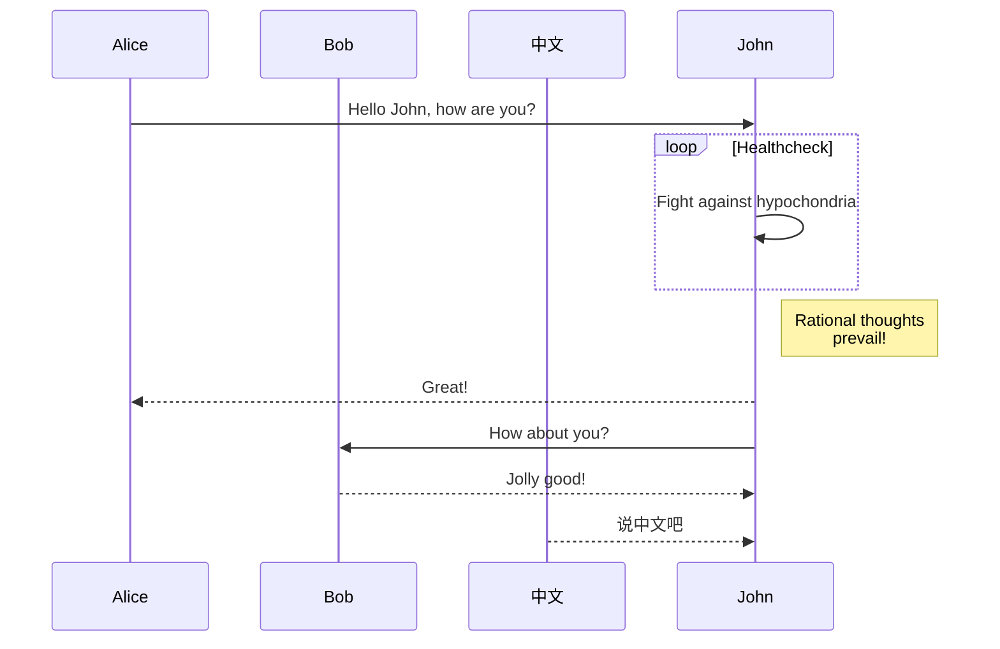

This looks good. 

This page is only for testing. 




1st Header|2nd Header|3rd Header
---|:---:|---: 
col 1 is|left-aligned|1
col 2 is|center-aligned|2
col 3 is|right-aligned|3
col 4 is|test-aligned|4

```python
def main():
    pass
```

```math
\sqrt{3}  # with or without delimiters
x_2+y_2
```

```goat
                          .--- a
  .                   .---+
  /\                  |   .--- b
 /  \               --+
a    b                .--- c 
```




}\int_{0}^{\infty}\frac{u^{s-1}}{e^{u}-1}\mathrm{d}u)

以下是一个公式


<div>
This is a page
</div>

This is <span style="color:#333 font-size:325%">written in red</span>.

\\[ x_2 + s_2 + g_2 \\] # display mode

是不是$q_2$是一个字符，这个会单独一行显示。


$$
\begin{align}
f(x) &=g(x)+\sin(\theta)+\cos(\theta) \\\\
     &=\mathcal{T}(\theta) 
\end{align}
$$

\\[ \begin{equation}f(x) =g(x)+\sin(\theta)+\cos(\theta) =\mathcal{T}(\theta) \end{equation}\\]


<div class="content_equimg">
<p>
asfsasdfas

</p>
</div>.
